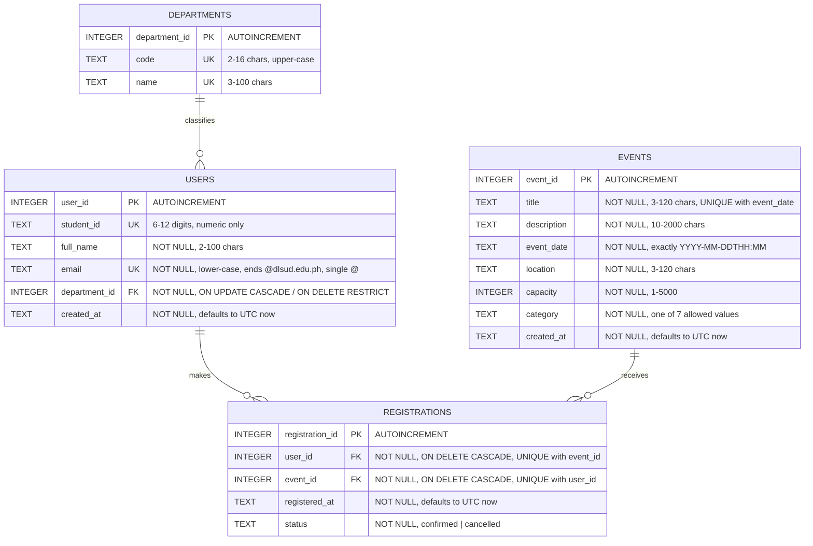
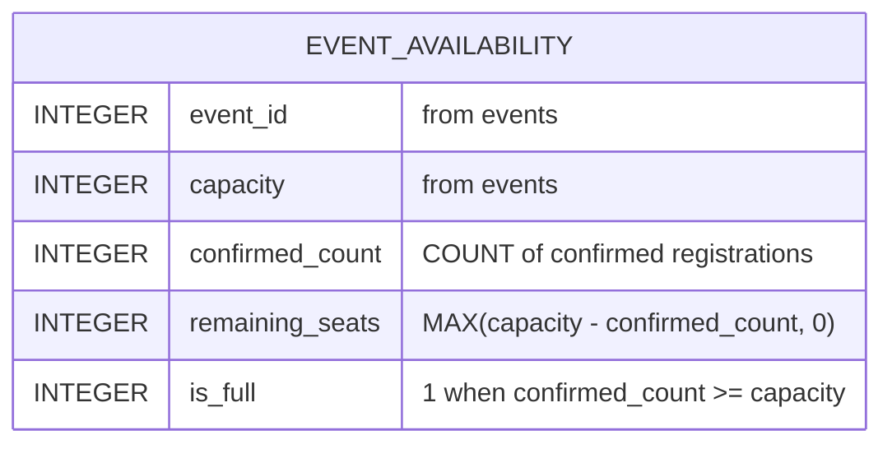

# DLSUD EventHub — Examination Submission

**Project:** DLSUD EventHub — campus event registration prototype
**Course:** 4th-year BSIT group laboratory examination
**Group members:** Basilides, Bellen, Cuento, Delmoro
**Repository:** <https://github.com/eximno/dlsud-eventhub>
**Live site:** GitHub Pages → Settings → Pages → *Deploy from a branch*, `main`, `/ (root)`

> **Before submitting:** assign each role placeholder in the
> [Verification log](#verification-log) to the group member who actually did
> that work (Basilides, Bellen, Cuento, Delmoro), and
> run `dotnet test tests/DlsudEventHub.Tests.csproj` on a machine with the
> .NET 8 SDK (see [What was and was not executed](#what-was-and-was-not-executed)).

---

## Contents

- [Task 1 — Requirements and prompt engineering](#task-1--requirements-and-prompt-engineering)
- [Task 2 — Frontend](#task-2--frontend)
- [Task 3 — Database and ERD](#task-3--database-and-erd)
- [Task 4A — Unit testing](#task-4a--unit-testing)
- [Task 4B — Security refactor](#task-4b--security-refactor)
- [Security audit](#security-audit)
- [Verification log](#verification-log)
- [What was and was not executed](#what-was-and-was-not-executed)
- [AI usage disclosure](#ai-usage-disclosure)
- [Definition of done](#definition-of-done)

---

## Task 1 — Requirements and prompt engineering

### 1.1 The RCTC prompt used

The prompt below is the one given to the AI assistant (Claude) to produce the
initial architecture. It follows **R**ole, **C**ontext, **T**ask,
**C**onstraints, and its constraints include explicit negative constraints.

```text
ROLE
You are a senior software architect who has shipped small internal web
systems for Philippine universities, and who also teaches a 4th-year BSIT
laboratory class. You optimise for what a group of students can actually
finish, demonstrate and defend.

CONTEXT
Four 4th-year BSIT students have a 3-hour closed laboratory examination.
They must deliver a working campus event registration prototype for
De La Salle University-Dasmarinas, called DLSUD EventHub, plus a database
schema, an ERD, unit tests, and a secure refactor of a deliberately flawed
C# data-access method. The finished prototype must be publicly reachable
through GitHub Pages, which is static hosting: it cannot run a server
process or a server-side database. The examiners will open the site,
read the SQL, read the tests, and ask why each decision was made.
The students have no budget and no cloud accounts.

TASK
Propose the simplest architecture that satisfies all of the following, and
justify every component in one sentence each:
  1. students can browse, search and filter campus events;
  2. students can open an event and register with a DLSU-D student e-mail;
  3. remaining seats are shown and capacity is enforced;
  4. duplicate registration is prevented;
  5. an admin view lists events, registration counts and attendees;
  6. a normalised relational schema (at least 3NF) with keys, constraints
     and indexes, expressible as a Mermaid ERD;
  7. business rules that can be unit tested without a running database;
  8. a C# service demonstrating parameterised SQL and correct resource
     disposal, delivered as a separate exercise rather than as the site's
     backend.
State clearly which parts run on GitHub Pages and which do not.

CONSTRAINTS
- Prefer vanilla HTML5, vanilla CSS and vanilla JavaScript.
- Use SQLite as the database, executed in the browser through sql.js /
  WebAssembly for the public prototype.
- Use C# with xUnit for the backend and testing deliverables.
- The whole frontend must run as a static site with relative paths only.
- Accessibility (WCAG 2.1 AA) and responsive layout are requirements, not
  extras.
- Every component must be defensible in a 5-minute oral explanation.
- NEGATIVE CONSTRAINT: do NOT introduce React, Next.js, Vue, Laravel,
  Express, any Node backend server, MySQL, PostgreSQL, Firebase, Supabase,
  Redux or any other state-management library, any authentication provider,
  any CSS framework, any bundler, or any build step. Do not propose
  containers, CI pipelines or cloud infrastructure. If a requirement seems
  to need one of these, say so explicitly and propose the simplest
  alternative instead.
- NEGATIVE CONSTRAINT: do not invent features that were not asked for.
```

### 1.2 Architecture output (summarised)

The assistant's **first** response — before the negative constraints were
tightened — proposed a three-tier system: a React single-page app, an
Express/ASP.NET Core REST API, PostgreSQL, JWT authentication, Docker Compose
for local development and a GitHub Actions pipeline. It was rejected: none of
it can run on GitHub Pages, and it is not finishable or defensible in three
hours.

The accepted architecture, after the prompt was tightened:

| Component | Decision | One-sentence justification |
|---|---|---|
| Presentation | Three static HTML pages + one CSS file | Semantic HTML5 and custom properties cover every layout and state requirement with no framework and no build step. |
| Behaviour | Five small vanilla JS modules | Separating pure rules (`validation.js`, `registration.js`) from data access (`database.js`) and from the DOM (`events.js`, `app.js`) is what makes the rules unit testable. |
| Database | SQLite compiled to WebAssembly via sql.js | Real SQL with real `CHECK`, `UNIQUE` and foreign-key constraints, running inside static hosting. |
| Persistence | The SQLite file exported to `localStorage` | A registration survives a reload without any server. |
| Schema source of truth | `database/schema.sql` + `database/seed.sql`, fetched at runtime | The SQL the examiners read is literally the SQL the site executes — the two cannot diverge. |
| Seat maths | A SQL view, `event_availability` | One definition of "seats left", shared by the catalog, the detail page and the admin dashboard. |
| Backend exercise | `backend/RegistrationService.cs`, standalone | GitHub Pages cannot execute C#, so the security deliverable is kept separate and honest rather than pretended into the site. |
| Tests | xUnit + Moq for C#; `node:test` for JavaScript | The repository depends on nothing at runtime, and both implementations of the same rules are pinned by tests. |
| Hosting | GitHub Pages from the repository root | Relative paths only; `../database/*.sql` resolves when the root is the site root. |

### 1.3 Manual grounding evaluation

The assistant's first architecture was technically coherent but completely
ungrounded in the examination's actual constraints: it assumed a server we
cannot deploy, a database we cannot host and a build pipeline we have no time
to configure, and it would have failed the single hard requirement that the
site be reachable on GitHub Pages. Tightening the prompt with explicit
negative constraints produced a usable proposal, but it still needed manual
correction — the assistant initially wanted to duplicate the schema as
JavaScript object literals "for convenience", which would have created two
sources of truth and guaranteed that the committed SQL and the running
prototype would drift apart. We rejected that and made the browser fetch and
execute `schema.sql` and `seed.sql` directly, which is both simpler and the
reason the ERD in this document can be trusted. The general lesson we took
from Task 1 is that an AI will happily optimise for an impressive-sounding
stack unless the prompt states, as a negative constraint, exactly what it is
not allowed to reach for.

---

## Task 2 — Frontend

| Requirement | Where it is satisfied |
|---|---|
| Semantic HTML5 | `header`, `nav`, `main`, `section`, `article`, `aside`, `footer`, `table`/`th[scope]`, `dl`, `time`; one `h1` per page, no skipped levels |
| Accessible forms | every control has a real `<label for>`; hints and errors wired with `aria-describedby`; `aria-invalid` on failure; `novalidate` so the app owns the messages |
| Accessible labels | `frontend/js/app.js` → `buildForm()`; filter labels in `frontend/index.html` |
| Colour contrast | all text ≥ 4.5:1; gold is used as a border/background accent, with `--gold-600` reserved for text on white (5.4:1) |
| Alt text / decoration | informative text is real text; decorative elements (seat bar, logo mark, alert glyphs) are `aria-hidden="true"` |
| Event catalog | `frontend/index.html` + `frontend/js/events.js` → `listEvents()`, `renderEventCard()` |
| Event registration form | `frontend/event.html` + `frontend/js/app.js` → `buildForm()`, `wireForm()`, `submitRegistration()` |
| Responsive UI | fluid grids, `clamp()` type, breakpoints at 960 px and 620 px; verified at 320/375/768 px with no horizontal overflow |
| Works as a static site | relative paths only; no API calls; runs from `python3 -m http.server` or GitHub Pages |

### Interaction states that were deliberately designed, not left to chance

| The user does this | What happens |
|---|---|
| Submits an empty form | all four fields report their own message, `aria-invalid` is set, a summary alert names how many fields need attention, and focus moves to the first invalid field |
| Enters another school's e-mail | "Only @dlsud.edu.ph student e-mail addresses can register." |
| Enters a look-alike domain (`@dlsud.edu.ph.fake.com`) | rejected — the domain is compared in full, never with a suffix match |
| Pastes 300 characters into a field | `maxlength` clamps it, and the rules reject anything still too long |
| Clicks Register repeatedly / very fast | a submitting flag plus a disabled, busy button means one registration; the panel also ignores pointer input for 500 ms after it swaps contents, so a stray second click cannot navigate away from the confirmation |
| Registers for a full event | the form is not rendered at all; a warning explains it and offers the catalog |
| Tries to register twice | refused against the e-mail field and in the summary; impossible to commit (`UNIQUE (user_id, event_id)`) |
| Reloads mid-flow | the `localStorage` snapshot restores the database, so a confirmed seat is still confirmed |
| Opens `event.html` with no id, `id=abc`, `id=0`, `id=-5`, `id=1.5` or an unknown id | a "not found" page with an explanation and a link back — never a crash or a blank page |
| Searches for something with no matches | an empty state that says what to try next, announced in a live region |
| Opens an event nobody has registered for | all seats shown as available; the admin attendee list shows "No one has registered for this event yet", not a blank table |
| Passes a bogus `?category=` or `?when=` to the catalog | the value is checked against what the `<select>` actually offers and ignored if unknown, so the full catalog is shown rather than an empty one |
| Searches with `%`, `_` or `'; DROP TABLE events;--` | treated as literal text: `LIKE` wildcards are escaped and the term is a bound parameter |
| Clears the filters | everything resets and focus returns to the search box |
| Uses the browser back button | filters are mirrored into the URL with `replaceState`, so the catalog view is restored |
| Presses Enter in the search field | the form submits to the filter handler; the page does not reload |
| Navigates by keyboard only | skip link first, visible focus ring everywhere, scrollable tables are focusable `<section>`s |
| Resizes to 320 px | single-column layout, full-width buttons, no clipped controls, no horizontal page scroll |
| Has `localStorage` blocked or full | the prototype keeps working in memory and says so in a warning — it does not fail the action |
| Loses `database/schema.sql` (404) | a readable "could not start" message explaining that the site must be served over http, not opened from the file system |

---

## Task 3 — Database and ERD

### 3.1 ERD (generated from the final `database/schema.sql`)



Plus one derived object, which stores nothing:



The ERD above was written from the finished schema and then checked
attribute-by-attribute against `database/schema.sql`. If you change the
schema, change this diagram in the same commit.

### 3.2 Why this is in third normal form

| Form | Why it holds |
|---|---|
| **1NF** | Every column holds one atomic value. There is no "events attended" list on a student and no comma-separated attendee column on an event; attendance is one row per student per event in `registrations`. |
| **2NF** | The only composite candidate key is `registrations (user_id, event_id)`, and the remaining attributes (`registered_at`, `status`) depend on that whole key — they describe *this student's attendance of this event*, not the student alone or the event alone. |
| **3NF** | No non-key column determines another non-key column. The college name is the case that would break this: storing `department` as text on `users` would make the name depend on the department rather than on the user, so it was extracted into `departments` and referenced by id. Seat counts are the other case: `registered_count` and `remaining_seats` are derivable from `registrations` and `capacity`, so they are **not stored** — they come from the `event_availability` view. Nothing can drift out of sync because nothing is duplicated. |

### 3.3 Constraint and index inventory

| Kind | Where |
|---|---|
| Primary keys | all four tables (`INTEGER PRIMARY KEY AUTOINCREMENT`) |
| Foreign keys | `users.department_id` → `departments`; `registrations.user_id` → `users`; `registrations.event_id` → `events`; all with explicit `ON UPDATE` / `ON DELETE` behaviour |
| `NOT NULL` | every column in every table — verified with `PRAGMA table_info`, there are no nullable non-key columns |
| `UNIQUE` | `departments.code`, `departments.name`, `users.student_id`, `users.email`, `events (title, event_date)`, **`registrations (user_id, event_id)`** |
| `CHECK` | upper-case department codes; numeric 6–12-digit student numbers; name/title/description/location lengths; the full `@dlsud.edu.ph` e-mail rule; `capacity BETWEEN 1 AND 5000`; strict `YYYY-MM-DDTHH:MM` dates; `category` in a fixed list; `status` in `('confirmed','cancelled')` |
| Indexes on FK columns | `idx_users_department_id`, `idx_registrations_user_id`, `idx_registrations_event_id` |
| Indexes for frequent queries | `idx_registrations_event_status` (seat counting), `idx_events_event_date` (catalog order), `idx_events_category` (catalog filter) |

`PRAGMA foreign_keys = ON` is issued on every connection — in `database.js`
for the browser and in `SqliteRegistrationRepository.OpenConnection()` for the
C# — because SQLite leaves foreign keys **off** by default and the constraints
would otherwise be decorative.

### 3.4 Evidence the constraints actually reject bad data

Run against the committed SQL with Python's bundled SQLite. Every one of these
was rejected, and a valid insert was accepted:

`@gmail.com` · `@dlsu.edu.ph` · `@dlsud.edu` · `@dlsud.edu.ph.fake.com` ·
`a@b@dlsud.edu.ph` · `@dlsud.edu.ph` (empty local part) · upper-case e-mail ·
non-numeric student number · unknown `department_id` · duplicate
`(user_id, event_id)` · `capacity = -5` · `capacity = 0` ·
`event_date = '12/01/2026'` · `event_date = '2026-13-01T09:00'` ·
`category = 'Party'` · `status = 'maybe'` · registration for a non-existent user.

---

## Task 4A — Unit testing

Two suites, because the rules exist in two languages and both need pinning.

### `tests/RegistrationServiceTests.cs` — xUnit + Moq

```bash
dotnet test tests/DlsudEventHub.Tests.csproj
```

`RegistrationService` depends on `IRegistrationRepository`, not on SQLite, so
the repository is replaced with a `Mock<IRegistrationRepository>` using
`MockBehavior.Strict`. That choice is itself an assertion: any unexpected
database call fails the test, which is how "invalid input never reaches the
database" is proved rather than assumed.

| Requirement under test | Tests |
|---|---|
| Valid DLSU-D e-mail accepted | 6 cases, including a padded mixed-case address |
| External / look-alike / malformed e-mail rejected | 22 cases, including `@dlsu.edu.ph`, `@dlsud.edu`, `@dlsud.edu.ph.fake.com`, `a@b@…`, consecutive dots, an injection payload, and `null` |
| Seats available | `99/100` allowed; `39/40` allowed and reported as one seat left |
| Event at capacity | `100/100` refused, 0 seats remaining, nothing written |
| Corrupted state | `140/100` refused and reported as 0 seats, never negative; `capacity <= 0` is an invalid event; a negative count is an invalid event |
| Duplicate registration | refused, nothing written; and reported as `Duplicate` rather than `EventFull` when both are true |
| Race on the last seat | the conditional insert returns null → reported as full, no receipt issued |
| Identity conflicts | e-mail on file under a different student number, and student number on file under a different e-mail, are both refused without writing |
| Invalid student details | 7 cases (empty, too short, injection payload, bad student numbers) refused with no database call at all |
| Unknown / invalid event | unknown id, `0` and `-1` refused; `0` and `-1` without touching the database |
| Past event | refused, nothing written |
| Normalisation | a padded, mixed-case e-mail, a hyphenated student number and a double-spaced name reach the repository in canonical form |
| Guard clause | a null repository throws `ArgumentNullException` at construction |

**Suite size:** 22 `[Fact]` tests and 6 `[Theory]` tests carrying 44
`[InlineData]` cases — 66 executable cases in total.

### `tests/validation.test.mjs` — `node:test`, zero dependencies

```bash
node --test "tests/**/*.test.mjs"
```

**Result: 31 tests, 31 passed.** These cover the same e-mail, seat and
duplicate rules against the JavaScript the website actually runs, plus the
rules that only exist on the client: search-term clamping, query-string event
ids, department allow-listing, and the guarantee that every refusal carries a
message a student can act on.

### What these tests deliberately do not do

- They do not assert on private helpers or on the order of DOM nodes; they
  assert on requirements, so a refactor that keeps the behaviour keeps the
  tests green.
- They do not mock the thing under test. The seat and e-mail rules are pure
  functions, called directly.
- No test was weakened, skipped or deleted to get a green run. Where a test
  failed, the implementation was fixed — see entries 1, 2 and 3 of the
  verification log.

---

## Task 4B — Security refactor

`backend/RegistrationService.cs`. The flawed original is kept verbatim in a
comment at the top of that file so the before/after can be read side by side.

### The original method's defects, and the fix for each

| # | Defect in the original | Fix |
|---|---|---|
| 1 | **SQL injection** — `"... VALUES ('" + email + "', " + eventId + ")"` | Every statement uses bound parameters (`$eventId`, `$email`, …). No user value is concatenated into SQL anywhere in the file. The only non-parameter text that varies is a fixed predicate chosen by the class itself, never by input. |
| 2 | **Hard-coded credentials** — `User Id=sa;Password=P@ssw0rd123;` committed to source control | The connection string is a constructor argument supplied from configuration, and is rejected if null or blank. The file contains no credentials, keys or tokens. |
| 3 | **Unmanaged connection** — `new SqlConnection(...)` never closed; leaked on every exception | `using SqliteConnection connection = OpenConnection();` in every method. |
| 4 | **Unmanaged command** — `new SqlCommand(...)` never disposed | `using SqliteCommand command = …`, `using SqliteDataReader reader = …`, and `using SqliteTransaction transaction = …` for the write paths. |
| 5 | **Unsafe null handling** — `cmd.ExecuteScalar().ToString()` throws `NullReferenceException` when there is no result | `ExecuteScalar()` results are checked against `null` **and** `DBNull.Value` before use; `reader.Read()` returning false is a normal "no such row" outcome that returns `null`; `reader.IsDBNull(i)` guards every column read; an unparseable stored date is handled explicitly instead of being treated as "in the past". |
| 6 | **No business rules** — any caller could over-subscribe an event or register twice | `RegistrationRules` is applied before any write, and the insert itself is guarded: `INSERT … SELECT … WHERE (SELECT COUNT(*) …) < (SELECT capacity …)`. Zero rows inserted means the event filled up first, which is reported, not crashed on. Combined with `UNIQUE (user_id, event_id)`, neither over-subscription nor a duplicate can be committed even under concurrent requests. |

### Additional hardening in the refactor

- `PRAGMA foreign_keys = ON` per connection, or the schema's foreign keys would
  not be enforced at all.
- A transaction around each write, with an explicit `Rollback()` on the
  "nothing was inserted" path, so no half-state can be committed.
- An identity guard: an e-mail already on file under a different student
  number is refused rather than silently overwritten.
- A `Func<DateTime>` clock is injected, so the "past event" rule is testable
  without waiting for time to pass.
- The business rules live in a separate static class from the data access, so
  the decision logic can be tested without a database and the SQL layer has no
  policy in it.

---

## Security audit

| Risk | Status in this prototype |
|---|---|
| SQL injection | **Mitigated.** All SQL in `frontend/js/*.js` and `backend/RegistrationService.cs` uses bound parameters. Verified by grep and by driving injection payloads through the search box, the form fields and the `?id=` parameter. |
| `LIKE` wildcard abuse | **Mitigated.** `%` and `_` in search text are escaped and the query uses `ESCAPE '\'`, so they match literally instead of matching everything. |
| XSS / unsafe DOM insertion | **Mitigated.** `innerHTML`, `outerHTML`, `insertAdjacentHTML`, `document.write`, `eval` and `new Function` do not appear anywhere in the repository. Every value is written with `createElement` + `textContent`, including the search-term highlighter, which splits text and builds `<mark>` nodes. |
| Unsafe URLs | **Mitigated.** Event links are built with `encodeURIComponent`; `javascript:` and `data:` URLs are never constructed from input. |
| Invalid identifiers | **Mitigated.** `?id=` is accepted only as a plain positive integer (`/^[0-9]{1,9}$/`), so `1.5`, `1e3`, `0x2`, `-5` and `1; DROP TABLE events` all produce a "not found" page. |
| Oversized input | **Mitigated.** `maxlength` in the UI, explicit ceilings in the rules (names 100, e-mail 100, student number 12, search 80) and `CHECK` length constraints in the schema. |
| Duplicate submission | **Mitigated.** Submitting flag, disabled busy button, re-check inside the transaction, `UNIQUE (user_id, event_id)`, and a pointer shield after the panel swaps so a stray repeat click cannot act on the new content. |
| Manipulated registration state | **Partly mitigated, and documented.** A corrupted or hand-edited database cannot produce negative seats or re-open a full event (the view clamps at 0, the rules treat over-subscription as full, and a non-positive capacity makes the event invalid). It cannot be *prevented*, because the data lives in the visitor's own browser. |
| Prototype pollution | **Not applicable in practice.** No deep-merge, no `Object.assign` over user input, no dynamic property assignment from parsed input; query parameters are read individually and validated. |
| Credential exposure | **None.** No passwords, keys or tokens anywhere in the repository. The C# connection string is injected from configuration. |
| Insecure local data assumptions | **Documented, not hidden.** The README and the admin page both state that browser-side SQLite is not authoritative and not secure. |
| Authentication / authorisation | **Absent by design, and labelled.** The admin page carries a banner saying it has no authentication and provides no real access control. |

**The honest summary:** this prototype has no server, so it has no trust
boundary. Everything in it can be read and rewritten by whoever controls the
browser. The injection and XSS mitigations are still worth having — they are
the habits that matter when a server does exist, and they are what
`backend/RegistrationService.cs` demonstrates properly — but no part of this
prototype should be mistaken for a security control.

---

## Verification log

Instances where AI-generated output was wrong, incomplete or over-built, and
what was done about it. Every entry below actually happened during this build;
the evidence column says how each was caught.

> **Member responsible** uses role placeholders. Replace each with the real
> group member's name before submitting.

| # | Task | AI flaw / limitation | Manual correction | How it was caught | Member responsible |
|---|---|---|---|---|---|
| 1 | 3 | The generated schema wrote `CHECK (event_date = strftime('%Y-%m-%dT%H:%M', event_date))`. For an unparseable value `strftime()` returns `NULL`, `'x' = NULL` evaluates to `NULL`, and SQLite treats a `NULL` `CHECK` as **satisfied** — so `'12/01/2026'` was accepted into the database. | Changed `=` to the `IS` operator, which compares against `NULL` correctly, and added a comment explaining why. `'12/01/2026'`, `'2026-12-01'`, `'2026-13-01T09:00'`, a value with seconds, and `''` are now all rejected. | A negative-constraint test script run against the committed SQL: 15 of 16 bad inserts were rejected and this one was not. | _Database lead — add name_ |
| 2 | 2 | The generated registration flow replaced the form with a confirmation panel the instant the insert succeeded. A fast double-click therefore landed its second click on the "Browse more events" link that had appeared where the submit button was, and the student was navigated to the catalog **away from their own reference number**. The data was correct — exactly one registration — but the user lost the confirmation. | Added a 500 ms pointer shield (`.panel--settling`) applied whenever the panel swaps its contents, so links and buttons inside it ignore pointer input briefly; keyboard users are unaffected because focus is moved to the panel. Added a regression check asserting that rapid repeat clicks neither duplicate the registration nor change the URL. | An end-to-end check that triple-clicks the submit button and then asserts the registration count; it aborted because the page had navigated. | _Frontend lead — add name_ |
| 3 | 2 | The generated "event not found" page rendered its message with an `<h3>` inside the main article, leaving that page with **no level-one heading** — a WCAG heading-structure failure on the one page a mistyped link lands on. | Gave the state renderer an explicit heading-level parameter and passed `h1` where the state *is* the page's main content (and `h2` for the admin failure state, which sits under the page `h1`). | `axe-core` 4.10 run over every page and every state: 1 violation, `page-has-heading-one`. | _Accessibility reviewer — add name_ |
| 4 | 2 | The generated admin markup used `<div role="region" aria-labelledby="…" tabindex="0">` for the horizontally scrollable tables — ARIA standing in for an element HTML already has. | Replaced both with `<section aria-labelledby="…" tabindex="0">`, which carries the same role natively. | `html-validate` (`prefer-native-element`). | _Accessibility reviewer — add name_ |
| 5 | 2 | The generated filter form had no submit button at all, because filtering happens on `input`. That fails WCAG technique H32 and leaves anyone who expects to press a button with nothing to press. | Added a real `type="submit"` **Search** button next to **Clear filters**, kept the live filtering, and kept the `submit` handler that already prevented a page reload on Enter. | `html-validate` (`wcag/h32`). | _Frontend lead — add name_ |
| 6 | 4 | The generated JavaScript name rule used the Latin-1 range `[A-Za-zÀ-ÿÑñ.'\- ]` while the generated C# rule used `[\p{L}.'\- ]`. The **same name could pass one layer and fail the other**, which is exactly the kind of silent divergence the three-layer design is supposed to avoid. | Aligned the JavaScript to `/^[\p{L}.'\- ]+$/u` so both implementations apply one rule, and noted the mirroring requirement in both files. | Line-by-line comparison of the JavaScript rules against the C# rules while writing the second test suite. | _Backend lead — add name_ |
| 7 | 4 | The first C# repository design checked capacity in application code and then inserted unconditionally. Two concurrent requests for the last seat would both pass the check and both insert, over-subscribing the event. | The insert now re-counts confirmed seats in its own `WHERE` clause, so the database enforces capacity; zero rows inserted is reported as "the last seat was taken while you were registering". A test drives that null-return path. | Design review of the write path: asking "what happens if two of these run at once?" | _Backend lead — add name_ |
| 8 | 1 / 2 | The first architecture proposal was a React SPA with an Express/ASP.NET REST API, PostgreSQL, JWT auth, Docker Compose and a CI pipeline — none of which can run on GitHub Pages, and none of which is finishable in a 3-hour laboratory slot. | Rejected it, tightened the prompt with explicit negative constraints, and implemented static HTML/CSS/JS + SQLite via sql.js. The repository has zero runtime dependencies beyond the two vendored sql.js files. | Checking the proposal against the hard requirement that the site be reachable on GitHub Pages. | _Team lead — add name_ |
| 9 | 2 | A generated CSS custom property was written as `--line-200: #e8ece a;` — an invalid value with a stray space, which silently produced no colour wherever the token was used. | Corrected the value and removed the defensive fallback that had been masking it. | Reading the generated stylesheet rather than trusting it, after a brace-balance check passed. | _Frontend lead — add name_ |
| 10 | 2 | Generated JavaScript left dead code behind: an unused object built in the blur handler, and five `catch (error)` blocks whose binding was never read. | Removed the dead object and converted the deliberately-ignored catches to ES2019 optional catch binding, so the intent ("this failure is expected and ignorable") is visible rather than implied. | ESLint 9 (`no-unused-vars`). | _Frontend lead — add name_ |

---

## What was and was not executed

Being specific about this, because "the tests pass" means nothing without
saying which tests actually ran.

### Executed, with results

| Check | Result |
|---|---|
| `node --test "tests/**/*.test.mjs"` | **31 tests, 31 passed** |
| SQLite schema + seed executed, `PRAGMA foreign_key_check` | **clean** |
| 16 negative constraint inserts + 1 valid insert | **all bad data rejected, valid data accepted** (after fixing log entry 1) |
| `node --check` on all 5 frontend modules | **clean** |
| ESLint 9 (`no-undef`, `no-unused-vars`, `eqeqeq`, `no-eval`, `no-implied-eval`, `no-new-func`, `curly`, …) | **clean** (after fixing log entry 10) |
| `html-validate` 8 (recommended + document + a11y presets) | **clean** (after fixing log entries 4 and 5) |
| `axe-core` 4.10 on 6 page states, at 1280 px and 320 px | **0 violations** (after fixing log entry 3) |
| `node tests/browser-checks.mjs` in Chromium | **91 checks, 91 passed, 0 console errors, 0 uncaught errors, 0 failed requests** |

### Not executed here

| Check | Why | What to do |
|---|---|---|
| `dotnet test tests/DlsudEventHub.Tests.csproj` | The build environment had no .NET SDK and could not download one (the Microsoft download host is blocked by its network policy). | Run it on any machine with the **.NET 8 SDK**. The C# was reviewed by hand, case-for-case against the JavaScript rules that *are* executed and passing. |
| Manual screen-reader pass (NVDA / VoiceOver) | No assistive technology available in the build environment. | `axe-core` and keyboard testing cover structure and focus, but a real screen-reader pass is still worth doing before the demo. |
| Real GitHub Pages URL | Pages must be enabled on the repository by its owner. | Settings → Pages → *Deploy from a branch* → `main` → `/ (root)`. The site was verified against a static server serving the repository root, which is the same path layout Pages produces. |

---

## AI usage disclosure

An AI assistant (Claude) was used to draft the initial architecture, first
versions of the SQL schema and seed data, the JavaScript modules, the C#
service, both test suites, and this documentation.

None of it was accepted as generated. Each artefact was read, executed where
possible, tested against the requirements, and corrected — ten substantive
corrections are listed above, three of which were genuine defects that would
have shipped: a `CHECK` constraint that accepted invalid dates, a double-click
that navigated students away from their own confirmation, and a page with no
level-one heading. Where a generated suggestion was heavier than the
requirements justified, it was simplified rather than kept, and the negative
constraints in the Task 1 prompt exist precisely because the first attempt
reached for a stack this examination cannot run.

---

## Definition of done

| Requirement | Status |
|---|---|
| DLSUD EventHub concept implemented | ✅ catalog, detail, registration, admin |
| Static GitHub Pages frontend works | ✅ relative paths, root entry point, `.nojekyll` |
| Browser-side SQLite through sql.js / WebAssembly | ✅ vendored, no CDN |
| Event catalog | ✅ search, category filter, upcoming/past/all |
| Event detail | ✅ with every invalid-id path handled |
| Registration | ✅ with receipt and reference number |
| DLSU-D e-mail validation | ✅ in the UI, the rules, the C# and the schema |
| Seat availability | ✅ derived in SQL, clamped at 0, enforced on insert |
| Duplicate registration prevented | ✅ UI, service, and `UNIQUE (user_id, event_id)` |
| Admin attendee view | ✅ counts, capacity, remaining, attendee list, reset |
| Semantic HTML | ✅ `html-validate` clean |
| WCAG-conscious accessibility | ✅ `axe-core` 0 violations, keyboard verified |
| Responsive layout | ✅ 320 / 375 / 768 / desktop, no horizontal overflow |
| Database at least 3NF | ✅ justified in §3.2 |
| Foreign keys | ✅ three, with explicit cascade behaviour |
| `CHECK` constraints | ✅ on every table |
| Foreign-key indexes | ✅ all three, plus three query indexes |
| Mermaid ERD matches the schema | ✅ checked attribute-by-attribute |
| `schema.sql` exists | ✅ `database/schema.sql` |
| `seed.sql` exists | ✅ `database/seed.sql` |
| `RegistrationService.cs` exists | ✅ `backend/RegistrationService.cs` |
| C# refactor uses parameterised SQL | ✅ no concatenation anywhere |
| C# resources disposed correctly | ✅ `using var` on connection, command, reader, transaction |
| Meaningful unit tests exist | ✅ xUnit + Moq, and 31 executed `node:test` tests |
| Tests verify real requirements | ✅ behaviour, not implementation detail |
| README accurate | ✅ including what was not executed |
| `SUBMISSION.md` satisfies every task | ✅ Tasks 1, 2, 3, 4A, 4B |
| AI disclosure exists | ✅ in both documents |
| Verification log exists | ✅ 10 entries, all real |
| No obvious console / runtime errors | ✅ 0 across 91 browser checks |
| No obvious prototype security vulnerability | ✅ audited above; architectural limits documented, not hidden |
| No unnecessary framework or infrastructure | ✅ zero runtime dependencies beyond vendored sql.js |
