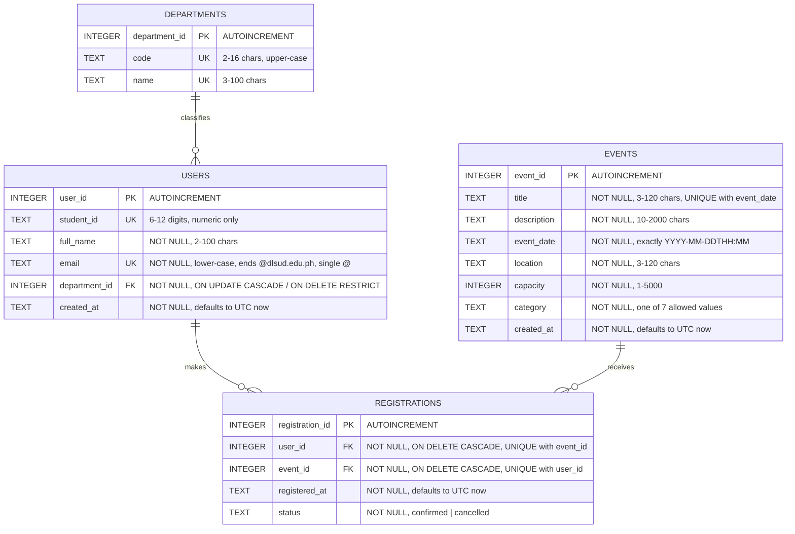
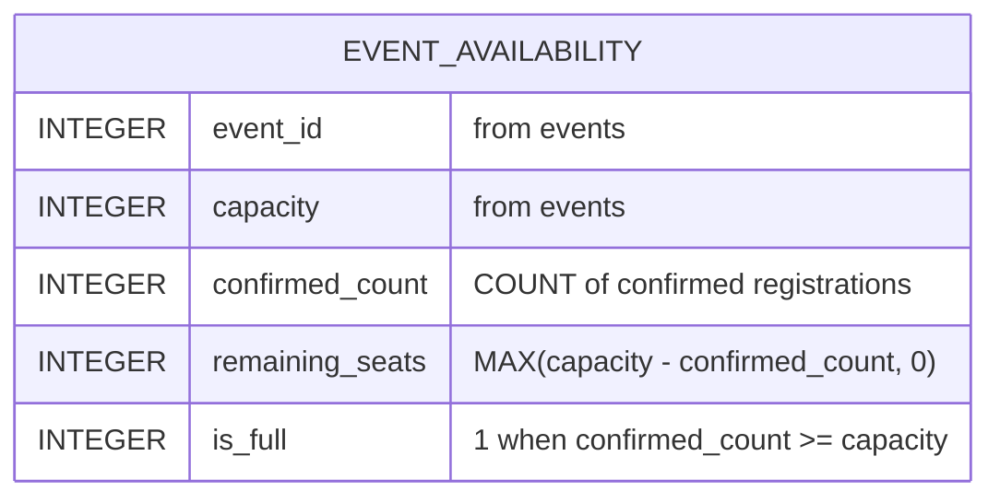

# DLSUD EventHub

## Group Laboratory Examination Submission

**Course:** 4th-year BSIT group laboratory examination
**Repository:** <https://github.com/eximno/dlsud-eventhub>
**Live site:** GitHub Pages → Settings → Pages → *Deploy from a branch*, `main`, `/ (root)`

> **How to read the prompts in this document.** The repository contains the
> Task 1 prompt (recorded below, verbatim) but **no separate master-prompt
> file**, and no chat transcripts. The Task 2, 3 and 4 prompts are therefore
> *task-specific prompts reconstructed for examination documentation* from the
> Task 1 prompt's requirements and constraints and from the examination brief.
> They are not transcripts of five independent AI conversations. Every
> "AI-Generated Output" section describes the **artefact that is actually in
> this repository**, and every correction cited in the Verification Log is
> traceable to a commit (`9f4c5fc`) or to a test/lint run named in §6.5.

---

## Contents

1. [Team Roster](#1-team-roster)
2. [Task 1 — Requirements Analysis & Prompt Architecture](#2-task-1--requirements-analysis--prompt-architecture)
3. [Task 2 — AI-Assisted Frontend Development](#3-task-2--ai-assisted-frontend-development)
4. [Task 3 — Database Design & ERD Generation](#4-task-3--database-design--erd-generation)
5. [Task 4 — Shift-Left Testing, Security & Refactoring](#5-task-4--shift-left-testing-security--refactoring)
6. [Task 5 — Group Integration & Verification Report](#6-task-5--group-integration--verification-report)

---

## 1. Team Roster

| Member | Role | Primary Responsibility |
|---|---|---|
| Timothy Delmoro | Systems Architect & Prompt Lead | Task 1 + Task 5 |
| Justin Basilides | Frontend Engineer | Task 2 |
| Aian Cuento | Database & Backend Engineer | Task 3 |
| Calvin Bellen | QA & Security Engineer | Task 4 |

---

## 2. Task 1 — Requirements Analysis & Prompt Architecture

*Owner: Timothy Delmoro*

### 2.1 Objective

Turn the examination brief into a defensible architecture for a 3-hour
prototype: a campus event registration system for De La Salle
University–Dasmariñas that must be publicly reachable on GitHub Pages
(static hosting, no server process, no server-side database).

### 2.2 Prompt Used

This is the Task 1 prompt as recorded by the team. It uses the RCTC structure
— **R**ole, **C**ontext, **T**ask, **C**onstraints — and carries two explicit
negative constraints (React/Express/PostgreSQL/etc. and "no invented
features").

```text
ROLE
You are a senior software architect who has shipped small internal web
systems for Philippine universities, and who also teaches a 4th-year BSIT
laboratory class. You optimise for what a group of students can actually
finish, demonstrate and defend.

CONTEXT
Four 4th-year BSIT students have a 3-hour closed laboratory examination.
They must deliver a working campus event registration prototype for
De La Salle University-Dasmarinas, called DLSUD EventHub, plus a database
schema, an ERD, unit tests, and a secure refactor of a deliberately flawed
C# data-access method. The finished prototype must be publicly reachable
through GitHub Pages, which is static hosting: it cannot run a server
process or a server-side database. The examiners will open the site,
read the SQL, read the tests, and ask why each decision was made.
The students have no budget and no cloud accounts.

TASK
Propose the simplest architecture that satisfies all of the following, and
justify every component in one sentence each:
  1. students can browse, search and filter campus events;
  2. students can open an event and register with a DLSU-D student e-mail;
  3. remaining seats are shown and capacity is enforced;
  4. duplicate registration is prevented;
  5. an admin view lists events, registration counts and attendees;
  6. a normalised relational schema (at least 3NF) with keys, constraints
     and indexes, expressible as a Mermaid ERD;
  7. business rules that can be unit tested without a running database;
  8. a C# service demonstrating parameterised SQL and correct resource
     disposal, delivered as a separate exercise rather than as the site's
     backend.
State clearly which parts run on GitHub Pages and which do not.

CONSTRAINTS
- Prefer vanilla HTML5, vanilla CSS and vanilla JavaScript.
- Use SQLite as the database, executed in the browser through sql.js /
  WebAssembly for the public prototype.
- Use C# with xUnit for the backend and testing deliverables.
- The whole frontend must run as a static site with relative paths only.
- Accessibility (WCAG 2.1 AA) and responsive layout are requirements, not
  extras.
- Every component must be defensible in a 5-minute oral explanation.
- NEGATIVE CONSTRAINT: do NOT introduce React, Next.js, Vue, Laravel,
  Express, any Node backend server, MySQL, PostgreSQL, Firebase, Supabase,
  Redux or any other state-management library, any authentication provider,
  any CSS framework, any bundler, or any build step. Do not propose
  containers, CI pipelines or cloud infrastructure. If a requirement seems
  to need one of these, say so explicitly and propose the simplest
  alternative instead.
- NEGATIVE CONSTRAINT: do not invent features that were not asked for.
```

### 2.3 AI-Generated Output

**Prompt requested:** the simplest architecture, with one-sentence
justification per component, and a clear statement of what runs on GitHub
Pages.

**AI output accepted by the team** (this is the architecture the repository
implements):

| Component | Decision | One-sentence justification |
|---|---|---|
| Presentation | Three static HTML pages + one CSS file | Semantic HTML5 and custom properties cover every layout and state requirement with no framework and no build step. |
| Behaviour | Five small vanilla JS modules | Separating pure rules (`validation.js`, `registration.js`) from data access (`database.js`) and from the DOM (`events.js`, `app.js`) is what makes the rules unit testable. |
| Database | SQLite compiled to WebAssembly via sql.js | Real SQL with real `CHECK`, `UNIQUE` and foreign-key constraints, running inside static hosting. |
| Persistence | The SQLite file exported to `localStorage` | A registration survives a reload without any server. |
| Schema source of truth | `database/schema.sql` + `database/seed.sql`, fetched at runtime | The SQL the examiners read is literally the SQL the site executes — the two cannot diverge. |
| Seat maths | A SQL view, `event_availability` | One definition of "seats left", shared by the catalog, the detail page and the admin dashboard. |
| Backend exercise | `backend/RegistrationService.cs`, standalone | GitHub Pages cannot execute C#, so the security deliverable is kept separate and honest rather than pretended into the site. |
| Tests | xUnit + Moq for C#; `node:test` for JavaScript | The repository depends on nothing at runtime, and both implementations of the same rules are pinned by tests. |
| Hosting | GitHub Pages from the repository root | Relative paths only; `../database/*.sql` resolves when the root is the site root. |

**What does not run on GitHub Pages:** `backend/RegistrationService.cs` and
its xUnit tests. They are a separate examination exercise (see Task 4), and the
site never calls them.

**Team-recorded first attempt.** The team recorded that the assistant's first
response, before the negative constraints were tightened, proposed a React SPA
with an Express/ASP.NET API, PostgreSQL, JWT, Docker Compose and CI, and that
it was rejected. *This is recorded from the team's memory of the session; the
repository holds no transcript that can confirm it, so it is not used as an
entry in the Verification Log.*

### 2.4 Manual Grounding Evaluation

The accepted architecture is realistic for a 3-hour examination: it needs no
installation, no build step and no accounts, and every component is a plain
file that can be opened and explained in a five-minute oral defence. The one
real risk — keeping a JavaScript copy of the schema alongside the SQL — was
removed by having the browser fetch and execute `database/schema.sql` and
`database/seed.sql` directly, so the SQL the examiners read is the SQL the site
runs. The cost is a known limitation: the database lives in each visitor's
browser, so it is a prototype, not a system of record, and the README says so.

### 2.5 Final Decision / Refinement

| | |
|---|---|
| **Prompt requested** | A lightweight architecture suitable for a 3-hour prototype. |
| **AI output** | A browser-based static architecture: HTML/CSS/vanilla JS with SQLite executed in the browser through sql.js. |
| **Team refinement** | Retained it; kept C# as a standalone, honestly-labelled exercise instead of pretending it backs the site; made the SQL files the single source of truth. |

---

## 3. Task 2 — AI-Assisted Frontend Development

*Owner: Justin Basilides*

### 3.1 Objective

A responsive, WCAG-conscious event catalog, event detail page and registration
form that runs as a static site.

### 3.2 Prompt Used

*Reconstructed task-specific prompt (see the note at the top of this
document); it carries the frontend requirements of the Task 1 prompt and
excludes database and C# requirements.*

```text
ROLE
You are a senior front-end engineer who specialises in accessible, framework-free web interfaces.

CONTEXT
DLSUD EventHub is a campus event registration prototype for De La Salle
University-Dasmarinas, built in a 3-hour examination and hosted on GitHub
Pages. Students must be able to find an event and register for it.

TASK
Build the front end: an event catalog with search and filters, an event detail
page, and a registration form (full name, student number, DLSU-D student
e-mail, department). Show remaining seats, and show validation feedback for
every field.

CONSTRAINTS
- Semantic HTML5 landmarks and heading structure.
- Responsive layout from 320 px upward.
- WCAG 2.1 AA: every form control has a programmatically associated label;
  ARIA only where HTML has no equivalent; accessible colour contrast; alt text
  for any informative image; visible validation feedback linked to its field;
  everything usable by keyboard alone.
- Vanilla HTML, CSS and JavaScript. Relative paths only (GitHub Pages).
- NEGATIVE CONSTRAINT: no framework, no CSS framework, no bundler, no CDN.
- NEGATIVE CONSTRAINT: do not rely on colour alone to convey seat status or errors.
```

### 3.3 AI-Generated Output

The generated front end is `frontend/index.html` (catalog), `frontend/event.html`
(detail + registration), `frontend/admin.html`, `frontend/css/styles.css` and
`frontend/js/{app,events,database,validation,registration}.js`, with a root
`index.html` that forwards to `frontend/`. How each requirement is met:

| Requirement | Where it is satisfied |
|---|---|
| Semantic HTML5 | `header`, `nav`, `main`, `section`, `article`, `aside`, `footer`, `table`/`th[scope]`, `dl`, `time`; one `h1` per page, no skipped levels |
| Accessible forms | every control has a real `<label for>`; hints and errors wired with `aria-describedby`; `aria-invalid` on failure; `novalidate` so the app owns the messages |
| Accessible labels | `frontend/js/app.js` → `buildForm()`; filter labels in `frontend/index.html` |
| Colour contrast | all text ≥ 4.5:1; gold is used as a border/background accent, with `--gold-600` reserved for text on white (5.4:1) |
| Alt text / decoration | informative text is real text; decorative elements (seat bar, logo mark, alert glyphs) are `aria-hidden="true"` |
| Event catalog | `frontend/index.html` + `frontend/js/events.js` → `listEvents()`, `renderEventCard()` |
| Event registration form | `frontend/event.html` + `frontend/js/app.js` → `buildForm()`, `wireForm()`, `submitRegistration()` |
| Responsive UI | fluid grids, `clamp()` type, breakpoints at 960 px and 620 px; verified at 320/375/768 px with no horizontal overflow |
| Works as a static site | relative paths only; no API calls; runs from `python3 -m http.server` or GitHub Pages |

Behaviour designed into the flow (all exercised by `tests/browser-checks.mjs`):

| The user does this | What happens |
|---|---|
| Submits an empty form | all four fields report their own message, `aria-invalid` is set, a summary alert names how many fields need attention, and focus moves to the first invalid field |
| Enters another school's e-mail | "Only @dlsud.edu.ph student e-mail addresses can register." |
| Enters a look-alike domain (`@dlsud.edu.ph.fake.com`) | rejected — the domain is compared in full, never with a suffix match |
| Pastes 300 characters into a field | `maxlength` clamps it, and the rules reject anything still too long |
| Clicks Register repeatedly / very fast | a submitting flag plus a disabled, busy button means one registration; the panel also ignores pointer input for 500 ms after it swaps contents, so a stray second click cannot navigate away from the confirmation |
| Registers for a full event | the form is not rendered at all; a warning explains it and offers the catalog |
| Tries to register twice | refused against the e-mail field and in the summary; impossible to commit (`UNIQUE (user_id, event_id)`) |
| Reloads mid-flow | the `localStorage` snapshot restores the database, so a confirmed seat is still confirmed |
| Opens `event.html` with no id, `id=abc`, `id=0`, `id=-5`, `id=1.5` or an unknown id | a "not found" page with an explanation and a link back — never a crash or a blank page |
| Searches for something with no matches | an empty state that says what to try next, announced in a live region |
| Opens an event nobody has registered for | all seats shown as available; the admin attendee list shows "No one has registered for this event yet", not a blank table |
| Passes a bogus `?category=` or `?when=` to the catalog | the value is checked against what the `<select>` actually offers and ignored if unknown, so the full catalog is shown rather than an empty one |
| Searches with `%`, `_` or `'; DROP TABLE events;--` | treated as literal text: `LIKE` wildcards are escaped and the term is a bound parameter |
| Clears the filters | everything resets and focus returns to the search box |
| Uses the browser back button | filters are mirrored into the URL with `replaceState`, so the catalog view is restored |
| Presses Enter in the search field | the form submits to the filter handler; the page does not reload |
| Navigates by keyboard only | skip link first, visible focus ring everywhere, scrollable tables are focusable `<section>`s |
| Resizes to 320 px | single-column layout, full-width buttons, no clipped controls, no horizontal page scroll |
| Has `localStorage` blocked or full | the prototype keeps working in memory and says so in a warning — it does not fail the action |
| Loses `database/schema.sql` (404) | a readable "could not start" message explaining that the site must be served over http, not opened from the file system |

### 3.4 Manual Corrections / Refinements

Defects found by auditing the generated front end (commit `9f4c5fc`):

| Generated behaviour | Correction |
|---|---|
| The "event not found" page rendered its message as an `<h3>`, leaving the page with no `h1` (flagged by axe-core as `page-has-heading-one`). | The state renderer takes a heading-level parameter; `h1` is passed where the state is the page's main content. |
| Scrollable tables used `<div role="region" tabindex="0">` (flagged by html-validate `prefer-native-element`). | Replaced with `<section aria-labelledby tabindex="0">`, which has the same role natively. |
| The filter form had no submit button because filtering runs on `input` (flagged by html-validate `wcag/h32`). | Added a real `type="submit"` **Search** button; live filtering and the Enter-key handler were kept. |
| A fast double-click on "Reserve my seat" landed the second click on the "Browse more events" link that replaced the button, so the student left their own confirmation. | Added a 500 ms pointer shield (`.panel--settling`) when a panel swaps contents; regression check added. |
| A CSS custom property was written `--line-200: #e8ece a;` (stray space), producing no colour. | Value corrected; the fallback that had masked it was removed. |
| Dead code and unused `catch (error)` bindings (ESLint `no-unused-vars`). | Removed; ignored catches use optional catch binding. |

### 3.5 Accessibility Verification

Verified in the repository:

- **Labels:** every field is built in `buildForm()` (`frontend/js/app.js`) with
  a `<label>` whose `htmlFor` matches the control id; hints and error
  containers are linked through `aria-describedby`; failures set
  `aria-invalid`; the form uses `novalidate` so the app owns the messages;
  inputs carry `autocomplete`, `maxlength`, and `inputmode` where relevant.
  Filter controls in `frontend/index.html` use `<label for>` too.
- **ARIA that exists:** `aria-label` on both `nav` elements and the
  registration `aside`, `aria-labelledby` on sections, `aria-live`/`role="status"`
  for results and field errors, `role="alert"` for the error summary,
  `aria-busy` on loading regions, `aria-current` for the current page,
  `aria-hidden` on decorative elements.
- **Keyboard:** skip link first, `:focus-visible` ring on all interactive
  elements (`styles.css`), focus moved to the first invalid field and to the
  confirmation panel.
- **Contrast / motion / touch:** gold text uses `--gold-600` (5.4:1 on white);
  `prefers-reduced-motion` is honoured; controls have a 44 px minimum height.
- **Images:** the project contains **no `` elements**, so there is no
  informative image needing alt text; decorative marks are `aria-hidden`.
- **Tooling run during the build:** html-validate (clean), axe-core 4.10 on six
  page states at 1280 px and 320 px (0 violations after the `h1` fix), and 91
  Playwright checks including keyboard focus order.
- **Not done:** a manual screen-reader pass (NVDA/VoiceOver). See §6.5.

---

## 4. Task 3 — Database Design & ERD Generation

*Owner: Aian Cuento*

### 4.1 Objective

A relational schema in at least 3NF, executable in SQLite, with an ERD that
matches it exactly.

### 4.2 Prompt Used

*Reconstructed task-specific prompt (see the note at the top of this
document).*

```text
ROLE
You are a database engineer experienced with SQLite and relational modelling.

CONTEXT
DLSUD EventHub lets DLSU-D students register for campus events. Students
belong to a department, events have a capacity, and a student may attend many
events. The same SQL must run in the browser (sql.js) and in a standalone
SQLite client.

TASK
Design the database and produce (1) SQLite-compatible DDL and (2) a Mermaid
ERD that matches it.

CONSTRAINTS
- At least 3NF, with at least 3 entities; justify the normal form.
- Primary keys on every table; foreign keys with explicit ON UPDATE/ON DELETE.
- CHECK constraints for the DLSU-D e-mail rule, capacity, dates, categories
  and status; UNIQUE constraints where justified (including one registration
  per student per event).
- An index on every foreign-key column.
- The ERD must list the same tables, columns and relationships as the SQL.
- NEGATIVE CONSTRAINT: do not store derived values (remaining seats,
  registered counts).
- NEGATIVE CONSTRAINT: no MySQL/PostgreSQL-only syntax.
```

### 4.3 AI-Generated Output

The generated artefacts are `database/schema.sql` (four tables, one view, six
indexes) and `database/seed.sql` (9 events, 8 departments, 112 sample students,
115 registrations, deliberately including a full event, a 39/40 event, an
empty event, a past event and a cancelled registration). The schema header
comment records the 3NF reasoning; the ERD is in §4.6.

### 4.4 Manual Corrections / Refinements

| Generated behaviour | Correction |
|---|---|
| `CHECK (event_date = strftime('%Y-%m-%dT%H:%M', event_date))`. For an unparseable value `strftime()` returns `NULL`, `x = NULL` is `NULL`, and SQLite treats a `NULL` CHECK as satisfied, so `'12/01/2026'` was **accepted**. | Changed `=` to `IS` (`schema.sql`, `events.event_date`) with an explanatory comment. Caught by a negative-insert script run against the committed SQL. |
| **Foreign-key indexes.** | **Not a defect in this project.** The three FK indexes were already in the first committed `schema.sql` (commit `373277a`), so no "AI omitted FK indexes" correction is claimed. |

### 4.5 Final 3NF Schema

The authoritative source is [`database/schema.sql`](database/schema.sql); it
is not duplicated here to avoid a second copy that could drift.

| Form | Why it holds |
|---|---|
| **1NF** | Every column holds one atomic value. There is no "events attended" list on a student and no comma-separated attendee column on an event; attendance is one row per student per event in `registrations`. |
| **2NF** | The only composite candidate key is `registrations (user_id, event_id)`, and the remaining attributes (`registered_at`, `status`) depend on that whole key — they describe *this student's attendance of this event*, not the student alone or the event alone. |
| **3NF** | No non-key column determines another non-key column. The college name is the case that would break this: storing `department` as text on `users` would make the name depend on the department rather than on the user, so it was extracted into `departments` and referenced by id. Seat counts are the other case: `registered_count` and `remaining_seats` are derivable from `registrations` and `capacity`, so they are **not stored** — they come from the `event_availability` view. Nothing can drift out of sync because nothing is duplicated. |

**Constraint and index inventory** (all verified present in `schema.sql`;
running the schema and seed in SQLite creates the six `idx_*` indexes and
`PRAGMA foreign_key_check` returns no rows):

| Kind | Where |
|---|---|
| Primary keys | all four tables (`INTEGER PRIMARY KEY AUTOINCREMENT`) |
| Foreign keys | `users.department_id` → `departments`; `registrations.user_id` → `users`; `registrations.event_id` → `events`; all with explicit `ON UPDATE` / `ON DELETE` behaviour |
| `NOT NULL` | every column in every table — verified with `PRAGMA table_info`, there are no nullable non-key columns |
| `UNIQUE` | `departments.code`, `departments.name`, `users.student_id`, `users.email`, `events (title, event_date)`, **`registrations (user_id, event_id)`** |
| `CHECK` | upper-case department codes; numeric 6–12-digit student numbers; name/title/description/location lengths; the full `@dlsud.edu.ph` e-mail rule; `capacity BETWEEN 1 AND 5000`; strict `YYYY-MM-DDTHH:MM` dates; `category` in a fixed list; `status` in `('confirmed','cancelled')` |
| Indexes on FK columns | `idx_users_department_id`, `idx_registrations_user_id`, `idx_registrations_event_id` |
| Indexes for frequent queries | `idx_registrations_event_status` (seat counting), `idx_events_event_date` (catalog order), `idx_events_category` (catalog filter) |

`PRAGMA foreign_keys = ON` is issued per connection in `schema.sql`, in
`database.js` (browser) and in `SqliteRegistrationRepository.OpenConnection()`
(C#), because SQLite leaves foreign keys off by default.

**Negative inserts rejected by the constraints** (script run against the
committed SQL with Python's `sqlite3`):

`@gmail.com` · `@dlsu.edu.ph` · `@dlsud.edu` · `@dlsud.edu.ph.fake.com` ·
`a@b@dlsud.edu.ph` · `@dlsud.edu.ph` (empty local part) · upper-case e-mail ·
non-numeric student number · unknown `department_id` · duplicate
`(user_id, event_id)` · `capacity = -5` · `capacity = 0` ·
`event_date = '12/01/2026'` · `event_date = '2026-13-01T09:00'` ·
`category = 'Party'` · `status = 'maybe'` · registration for a non-existent user.

### 4.6 Mermaid ERD

Written from the final `database/schema.sql` and checked table-by-table,
column-by-column and key-by-key against it (tables, column names, PK/FK/UK
markers, `ON DELETE` behaviour, and cardinality: one department to many users;
one user to many registrations; one event to many registrations).



Plus one derived object, which stores nothing:



---

## 5. Task 4 — Shift-Left Testing, Security & Refactoring

*Owner: Calvin Bellen*

### 5.1 Objective

Unit-test the registration business rules, then review and refactor a
deliberately flawed C# data-access method for security and resource safety.

### 5.2 Prompt Used

*Reconstructed task-specific prompt (see the note at the top of this
document).*

```text
ROLE
You are a QA and application-security engineer reviewing C# data-access code.

CONTEXT
DLSUD EventHub registers students for events. The following legacy method
is deliberately flawed:

    public bool RegisterStudent(string email, string eventId)
    {
        SqlConnection conn = new SqlConnection("Server=.;Database=EventHub;User Id=sa;Password=P@ssw0rd123;");
        conn.Open();
        string sql = "INSERT INTO Registrations (Email, EventId) VALUES ('" + email + "', " + eventId + ")";
        SqlCommand cmd = new SqlCommand(sql, conn);
        int rows = cmd.ExecuteNonQuery();
        string name = cmd.ExecuteScalar().ToString();
        return rows > 0;
    }

TASK
(1) Write xUnit tests for: DLSU-D e-mail validation, an invalid e-mail,
available seats, a full event, and duplicate registration.
(2) Review the method for SQL injection, string-concatenated SQL, resource
disposal, null handling and hard-coded credentials, and explain each finding.
(3) Refactor it.

CONSTRAINTS
- Parameterised queries with safe parameter binding.
- using / using var for every connection, command, reader and transaction.
- Safe handling of null and DBNull results.
- No real credentials; the connection string comes from configuration.
- Tests assert requirements (behaviour), not implementation details.
- NEGATIVE CONSTRAINT: do not concatenate user input into SQL anywhere.
- NEGATIVE CONSTRAINT: do not weaken or skip a test to make it pass.
```

### 5.3 AI-Generated Output

The output is `backend/RegistrationService.cs` (business rules, a mockable
`IRegistrationRepository`, `RegistrationService`, and
`SqliteRegistrationRepository`) and `tests/RegistrationServiceTests.cs`. The
original flawed method is preserved in a comment at the top of
`RegistrationService.cs` as the "before".

### 5.4 Security Findings

Findings against the original method, each present in the preserved code:

| # | Finding | Evidence in the original |
|---|---|---|
| 1 | **SQL injection / string-concatenated SQL** | `"... VALUES ('" + email + "', " + eventId + ")"` |
| 2 | **Hard-coded credentials** | `User Id=sa;Password=P@ssw0rd123;` in source |
| 3 | **Connection not disposed** | `new SqlConnection(...)`, never closed; leaks on exception |
| 4 | **Command not disposed** | `new SqlCommand(...)`, never disposed |
| 5 | **Null dereference** | `cmd.ExecuteScalar().ToString()` throws when the result is null |
| 6 | **No business rules** | no capacity, duplicate or e-mail check |

### 5.5 Refactored Solution

`backend/RegistrationService.cs`:

| Finding | Fix in the final file |
|---|---|
| 1 | Every statement uses bound parameters (`$eventId`, `$email`, …) through `command.Parameters.AddWithValue`. Each `CommandText` is a constant literal. |
| 2 | `SqliteRegistrationRepository(string connectionString)` receives the connection string from the caller and throws if it is null/blank. The file contains no credentials. |
| 3–4 | `using SqliteConnection`, `using SqliteCommand`, `using SqliteDataReader` and `using SqliteTransaction` in every method. |
| 5 | `ExecuteScalar()` results are checked for `null` and `DBNull.Value`; `reader.Read()` returning false returns `null`; `reader.IsDBNull(i)` guards column reads; an unparseable stored date is handled explicitly. |
| 6 | `RegistrationRules.Decide` runs before any write; the insert is `INSERT … SELECT … WHERE (SELECT COUNT(*) …) < (SELECT capacity …)`, so capacity is enforced by the database, and `UNIQUE (user_id, event_id)` blocks duplicates. Writes run in a transaction with an explicit `Rollback()` on the "nothing inserted" path. |

### 5.6 Unit Test Verification

`tests/RegistrationServiceTests.cs` — xUnit + Moq, the repository mocked with
`MockBehavior.Strict` so that any unexpected database call fails the test
(this is how "invalid input never reaches the database" is asserted).
Counted from the file: **22 `[Fact]` tests and 6 `[Theory]` tests with 44
`[InlineData]` cases.**

| Requirement under test | Tests |
|---|---|
| Valid DLSU-D e-mail accepted | 6 cases, including a padded mixed-case address |
| External / look-alike / malformed e-mail rejected | 22 cases, including `@dlsu.edu.ph`, `@dlsud.edu`, `@dlsud.edu.ph.fake.com`, `a@b@…`, consecutive dots, an injection payload, and `null` |
| Seats available | `99/100` allowed; `39/40` allowed and reported as one seat left |
| Event at capacity | `100/100` refused, 0 seats remaining, nothing written |
| Corrupted state | `140/100` refused and reported as 0 seats, never negative; `capacity <= 0` is an invalid event; a negative count is an invalid event |
| Duplicate registration | refused, nothing written; and reported as `Duplicate` rather than `EventFull` when both are true |
| Race on the last seat | the conditional insert returns null → reported as full, no receipt issued |
| Identity conflicts | e-mail on file under a different student number, and student number on file under a different e-mail, are both refused without writing |
| Invalid student details | 7 cases (empty, too short, injection payload, bad student numbers) refused with no database call at all |
| Unknown / invalid event | unknown id, `0` and `-1` refused; `0` and `-1` without touching the database |
| Past event | refused, nothing written |
| Normalisation | a padded, mixed-case e-mail, a hyphenated student number and a double-spaced name reach the repository in canonical form |
| Guard clause | a null repository throws `ArgumentNullException` at construction |

`tests/validation.test.mjs` pins the same e-mail, seat and duplicate rules
against the JavaScript the website runs.

> **Execution status — be precise.**
> `node --test "tests/**/*.test.mjs"` was run and gives **31 tests, 31
> passed** (re-run while preparing this document).
> `dotnet test tests/DlsudEventHub.Tests.csproj` has **not** been executed: the
> build environment has no .NET SDK. The C# tests were reviewed by hand and
> are **not** claimed to have passed. Run the command on a machine with the
> .NET 8 SDK and record the result before submitting.

### 5.7 Manual Corrections / Refinements

| Generated behaviour | Correction |
|---|---|
| `FindStudentByEmail`/`FindStudentByStudentId` shared a helper that built `CommandText` as `"SELECT … WHERE " + predicate + " LIMIT 1;"`. The predicate was a class-chosen constant, not user input, so it was not exploitable, but `CommandText` was no longer a literal and "no SQL is concatenated" was not literally true. | Replaced with two complete constant statements, each with its own bound parameter (commit `9f4c5fc`). |
| The JavaScript name rule used the Latin-1 range `[A-Za-zÀ-ÿÑñ.'\- ]` while the C# rule used `[\p{L}.'\- ]`, so one name could pass one layer and fail the other. | JavaScript aligned to `/^[\p{L}.'\- ]+$/u`; a mirroring note added to both files. |
| **Resource disposal.** | **Not a defect in this project.** `using` declarations were already in the first committed `RegistrationService.cs` (commit `373277a`), so no "AI did not dispose resources" correction is claimed. |

---

## 6. Task 5 — Group Integration & Verification Report

*Owner: Timothy Delmoro, with contributions from all members.*

### 6.1 Integration Summary

| Deliverable | Location | Owner |
|---|---|---|
| Requirements, architecture, RCTC prompt | §2 of this file; `README.md` (Architecture) | Timothy Delmoro |
| Front end (catalog, detail, registration, admin) | `frontend/`, root `index.html` | Justin Basilides |
| Schema, seed data, ERD | `database/schema.sql`, `database/seed.sql`, §4.6 | Aian Cuento |
| C# service, unit tests, security review | `backend/RegistrationService.cs`, `tests/` | Calvin Bellen |
| Integration, setup, disclosure, verification log | this section, `README.md` | Timothy Delmoro |

The pieces connect through one contract: the browser executes
`database/schema.sql` and `database/seed.sql` through sql.js, and the C# service
and tests implement the same rules against the same schema. The site does not
call the C# code.

### 6.2 Setup Instructions

1. **Get the code.** `git clone https://github.com/eximno/dlsud-eventhub.git`
   then `cd dlsud-eventhub` (or use *Code → Download ZIP* on GitHub and unzip).
2. **Run the site locally.** It must be served over http, not opened as a file:
   `python3 -m http.server 8000`, then open <http://localhost:8000/>. Serve the
   repository **root**, not `frontend/`. Nothing needs installing or building.
3. **Public site.** After enabling Pages (Settings → Pages → *Deploy from a
   branch* → `main` → `/ (root)`), the site is at
   `https://eximno.github.io/dlsud-eventhub/`. Not verified on the real Pages
   URL — see §6.5.
4. **Inspect the SQLite database.** With the `sqlite3` CLI:
   `sqlite3 /tmp/eventhub.db < database/schema.sql`,
   `sqlite3 /tmp/eventhub.db < database/seed.sql`, then
   `sqlite3 /tmp/eventhub.db "SELECT title, capacity, confirmed_count, remaining_seats FROM event_availability;"`.
   Without it, use the Python snippet in `README.md` ("Inspecting the SQL
   outside the browser"). In the running site, the Admin page shows the same
   data.
5. **Run the tests.** JavaScript (needs Node 18+):
   `node --test "tests/**/*.test.mjs"`. C# (needs the .NET 8 SDK):
   `dotnet test tests/DlsudEventHub.Tests.csproj`.
6. **Where each deliverable is:** see the table in §6.1.

### 6.3 AI Disclosure Statement

An AI assistant (Claude) was used for: requirements and architecture
ideation (Task 1); front-end generation and refinement (Task 2); database
schema and seed generation and the Mermaid ERD (Task 3); unit-test drafting,
security analysis and the C# refactor (Task 4); and drafting this
documentation and the README.

The team reviewed, executed where possible, and corrected the output; the
corrections that can be traced to the repository are in the Verification Log.
This does **not** mean every result was changed — some generated artefacts
were kept as produced after review (for example the foreign-key indexes and the
`using` declarations, which needed no correction). Manual verification claims
in this document are limited to what §6.5 lists as executed. The Task 2–4
prompts are reconstructions, as stated at the top of this document.

### 6.4 Verification Log

Each entry is traceable to commit `9f4c5fc` (the audit commit) and to the tool
that caught it. *Member responsible* follows the roster's task ownership.

| Task # | Identified AI Flaw / Limitation | Manual Correction Applied | Caught by | Member Responsible |
|---|---|---|---|---|
| Task 2 | The "event not found" state was rendered with an `<h3>`, so the page had **no level-one heading** (WCAG heading structure). | Added a heading-level parameter to the state renderer and used `h1` where the state is the page's main content. | axe-core 4.10 (`page-has-heading-one`) | Justin Basilides |
| Task 2 | The filter form had **no submit button** (WCAG technique H32), and a fast double-click on the register button navigated the student away from their own confirmation. | Added a real `type="submit"` Search button; added a 500 ms pointer shield on panel swaps plus a regression check. | html-validate (`wcag/h32`); a triple-click end-to-end check | Justin Basilides |
| Task 3 | `CHECK (event_date = strftime(...))` silently **accepted invalid dates** because `x = NULL` is NULL and SQLite treats a NULL CHECK as passing. | Changed `=` to `IS`, with a comment; `'12/01/2026'`, `'2026-13-01T09:00'`, values with seconds and `''` are now rejected. | Negative-insert script against the committed SQL | Aian Cuento |
| Task 4 | Generated repository built `CommandText` by **concatenating** a predicate string, so the constant-SQL guarantee did not literally hold. | Replaced with two complete constant, parameterised statements. | Security review of every `CommandText` | Calvin Bellen |
| Task 4 | The JavaScript and C# **name rules diverged** (Latin-1 range vs `\p{L}`); the same name could pass one layer and fail the other. | Aligned the JavaScript to `\p{L}` and documented the mirroring in both files. | Line-by-line comparison while writing the second test suite | Calvin Bellen |

**Not entered as flaws (checked against the repository and found not to have
happened):** missing `aria-label`/labels on required inputs (labels were in the
first commit), omitted foreign-key indexes (present in the first commit), and
undisposed database resources (`using` was present in the first commit).

### 6.5 Final Verification

**Executed, with results**

| Check | Result |
|---|---|
| `node --test "tests/**/*.test.mjs"` | 31 tests, 31 passed (re-run for this document) |
| `schema.sql` + `seed.sql` loaded in SQLite; `PRAGMA foreign_key_check` | no violations; 9 events, 112 users, 115 registrations; all six `idx_*` indexes exist |
| html-validate, ESLint 9, axe-core 4.10, `node tests/browser-checks.mjs` (Chromium) | Reported clean / 0 violations / 91 of 91 checks by the build session (`README.md`, commit messages); not re-run for this document |

**Not executed**

| Check | Status |
|---|---|
| `dotnet test` | **Not run** — no .NET SDK in the build environment. C# test results are unknown. |
| Screen-reader pass (NVDA / VoiceOver) | **Not done.** |
| Live GitHub Pages URL | **Not verified**; tested via a local static server serving the repository root. |

**Known limitations:** browser-side SQLite is local to each visitor and not a
secure system of record; the admin page has no authentication. Both are stated
in `README.md` and on the admin page.

### Security audit (supporting)

| Risk | Status in this prototype |
|---|---|
| SQL injection | **Mitigated.** All SQL in `frontend/js/*.js` and `backend/RegistrationService.cs` uses bound parameters. Verified by grep and by driving injection payloads through the search box, the form fields and the `?id=` parameter. |
| `LIKE` wildcard abuse | **Mitigated.** `%` and `_` in search text are escaped and the query uses `ESCAPE '\'`, so they match literally instead of matching everything. |
| XSS / unsafe DOM insertion | **Mitigated.** `innerHTML`, `outerHTML`, `insertAdjacentHTML`, `document.write`, `eval` and `new Function` do not appear anywhere in the repository. Every value is written with `createElement` + `textContent`, including the search-term highlighter, which splits text and builds `<mark>` nodes. |
| Unsafe URLs | **Mitigated.** Event links are built with `encodeURIComponent`; `javascript:` and `data:` URLs are never constructed from input. |
| Invalid identifiers | **Mitigated.** `?id=` is accepted only as a plain positive integer (`/^[0-9]{1,9}$/`), so `1.5`, `1e3`, `0x2`, `-5` and `1; DROP TABLE events` all produce a "not found" page. |
| Oversized input | **Mitigated.** `maxlength` in the UI, explicit ceilings in the rules (names 100, e-mail 100, student number 12, search 80) and `CHECK` length constraints in the schema. |
| Duplicate submission | **Mitigated.** Submitting flag, disabled busy button, re-check inside the transaction, `UNIQUE (user_id, event_id)`, and a pointer shield after the panel swaps so a stray repeat click cannot act on the new content. |
| Manipulated registration state | **Partly mitigated, and documented.** A corrupted or hand-edited database cannot produce negative seats or re-open a full event (the view clamps at 0, the rules treat over-subscription as full, and a non-positive capacity makes the event invalid). It cannot be *prevented*, because the data lives in the visitor's own browser. |
| Prototype pollution | **Not applicable in practice.** No deep-merge, no `Object.assign` over user input, no dynamic property assignment from parsed input; query parameters are read individually and validated. |
| Credential exposure | **None.** No passwords, keys or tokens anywhere in the repository. The C# connection string is injected from configuration. |
| Insecure local data assumptions | **Documented, not hidden.** The README and the admin page both state that browser-side SQLite is not authoritative and not secure. |
| Authentication / authorisation | **Absent by design, and labelled.** The admin page carries a banner saying it has no authentication and provides no real access control. |

The prototype has no server and therefore no trust boundary; the injection and
XSS mitigations are habits that matter once a server exists, which is what
`backend/RegistrationService.cs` demonstrates.
